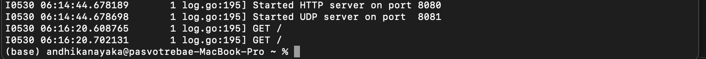

# Module 11
## Andhika Nayaka Arya Wibowo - 2306174135

---

## Reflection: Hello Minikube Tutorial

### 1. Application Logs Before and After Service Exposure

Before exposing the pod as a service, the logs showed a one-time startup message indicating that the HTTP and UDP servers were started:

After exposing the pod and accessing the app via `minikube service hello-node`, the logs updated **each time I opened the URL** in the browser. This indicates that every page visit triggers an HTTP request handled by the pod, confirming that the service routing works properly.

Additionally, this combined view shows how the log evolves from just a startup message to multiple `GET /` events:

---

### 2. Understanding `kubectl get` vs `kubectl get -n kube-system`

The `kubectl get` command without the `-n` option lists resources in the **default namespace**, where my `hello-node` deployment and pod were created.

On the other hand, `kubectl get pods -n kube-system` lists resources in the **kube-system namespace**, which includes internal components like DNS, the metrics-server, and the Kubernetes dashboard itself.

That's why I didn’t see my app in the `kube-system` namespace — user deployments and system services are logically separated into different namespaces. This helps in isolating workloads and managing access.

---

### 3. Kubernetes Dashboard Overview

This is the dashboard showing the status of my deployment, pod, and replicaset — all running properly:

---

### 4. Summary

This tutorial helped me understand:
- How to run a local Kubernetes cluster with Minikube
- Deploy containers using `kubectl`
- Use services to expose pods to the outside world
- Monitor the system with the Kubernetes Dashboard and `kubectl`
- The concept and practical usage of namespaces in Kubernetes

---

## Reflection: Rolling Update & Kubernetes Manifest File

### 1. What is the difference between Rolling Update and Recreate?

The **Rolling Update** strategy updates pods gradually by creating new pods and terminating the old ones incrementally. This ensures **zero downtime**.

In contrast, the **Recreate** strategy first **terminates all old pods**, then creates the new ones. This causes **downtime** but ensures a clean replacement.

---

### 2. Recreate Deployment Attempt

I deployed the Spring Petclinic REST app using the `Recreate` strategy via a separate YAML manifest. Here’s a screenshot of the deployment process where old pods were terminated before new ones were created:

And here's the service exposure showing successful deployment:

---

### 3. Manifest Files for Recreate Strategy

I created two files:
- `recreate-deployment.yaml`
- `recreate-service.yaml`

Both are stored in the same directory as this README file.

---

### 4. Benefits of Kubernetes Manifest Files

Using manifest files made my workflow more:
- **Repeatable**: I could reapply the same configuration after deleting Minikube.
- **Versioned**: Easy to track changes via Git commits.
- **Clearer**: YAML lets me specify deployment strategies, port mapping, labels, and replicas cleanly.

Compared to `kubectl` CLI deployment, manifests made the setup **much faster and reliable**, especially when re-deploying after wiping the cluster.

---